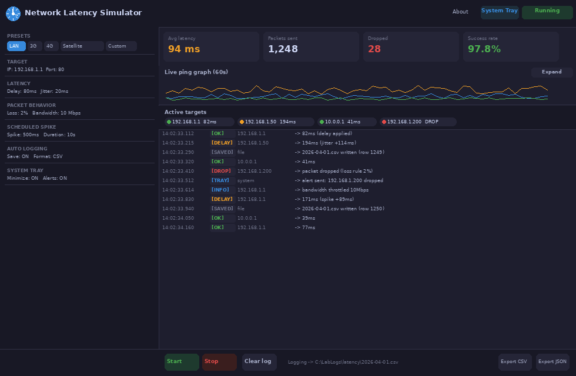
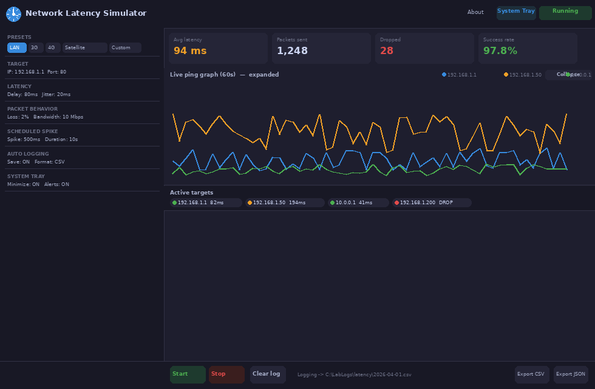
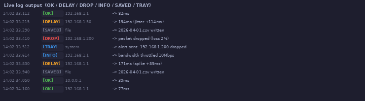
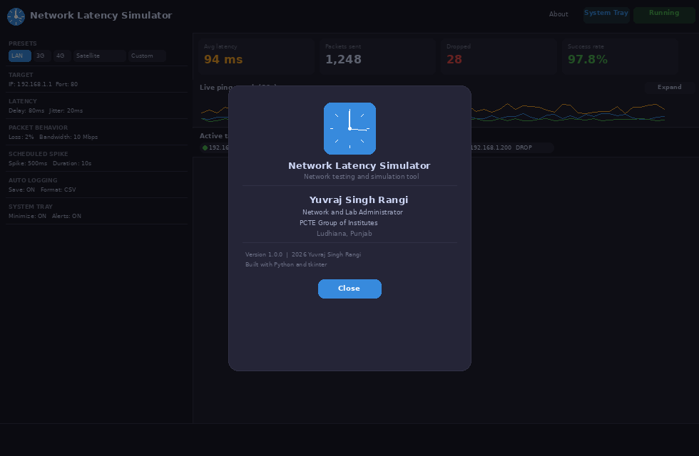

# 🕐 Network Latency Simulator

> A professional dark-themed desktop tool to simulate real-world network conditions — built with Python and tkinter.


---

## 📸 Screenshots

| Main Window | Expanded Graph |
|---|---|
|  |  |

| Live Log Panel | About Dialog |
|---|---|
|  |  |

---

## 📋 About This Project

**Network Latency Simulator** is a desktop application developed by **Yuvraj Singh Rangi**, Network and Lab Administrator at **PCTE Group of Institutes, Ludhiana, Punjab**.

The tool lets you simulate degraded network conditions — high latency, jitter, packet loss, and bandwidth limits — on any target IP or hostname, directly from your PC. No external hardware or complex setup is required. Everything runs in software.

It was built for use in the campus computer labs to test how applications and services behave under poor network conditions, and to demonstrate real-world networking concepts to students.

---

## ✨ Features

| Feature | Description |
|---|---|
| **Presets** | One-click LAN, 3G, 4G, Satellite, and Custom profiles |
| **Base Delay** | Add 0 to 2000ms of artificial latency to every packet |
| **Jitter** | Random variation on top of base delay |
| **Packet Loss** | Drop a configurable percentage of packets randomly |
| **Bandwidth Throttle** | Limit simulated throughput in Mbps |
| **Multiple Targets** | Add multiple IPs — each runs in its own background thread |
| **Live Ping Graph** | 60-second matplotlib graph, compact or expanded view |
| **Scheduled Spike** | Fire a sudden latency spike for N seconds at any time |
| **Color-coded Log** | OK / DELAY / DROP / INFO / SAVED / TRAY event tags |
| **Auto File Logging** | Save logs to CSV, JSON, or TXT automatically |
| **Export Logs** | Export on-screen log to any location |
| **System Tray** | Minimize to tray, start with Windows, drop alerts |
| **About Dialog** | Author, institution, version, and build info |
| **Custom Icon** | Embedded ICO with 6 size variants |
| **Dark Theme UI** | Clean dark interface built for lab use |
| **Windows .exe** | Compile to standalone executable with PyInstaller |

---

## 🚀 Getting Started

### Requirements

- Python 3.8 or higher
- Windows 7 / 10 / 11 (or Linux / macOS)
- Administrator/root access recommended for ICMP ping mode

### Install Dependencies

```bash
pip install matplotlib pillow pystray
```

### Run the App

```bash
python latency_simulator.py
```

> On Windows, run your terminal as **Administrator** when using ICMP ping mode so the app can create raw sockets.
> If you do not have admin access, switch to **TCP** mode in the sidebar — it works without elevated privileges.

---

## 🏗️ Build Windows .exe

Make sure both files are in the same folder:

```
latency_simulator.py
latency_simulator.ico
```

Then run:

```bash
pip install pyinstaller
pyinstaller --onefile --windowed --icon=latency_simulator.ico --name=LatencySimulator latency_simulator.py
```

Your compiled `.exe` will appear in the `dist/` folder. Copy it to any lab PC — no Python installation needed.

---

## 🗂️ Project Structure

```
network-latency-simulator/
│
├── latency_simulator.py        # Main application source code
├── latency_simulator.ico       # Application icon (all sizes embedded)
├── README.md                   # This file
│
├── screenshots/
│   ├── 01_main_window.png
│   ├── 02_graph_expanded.png
│   ├── 03_about_dialog.png
│   ├── 04_icon_closeup.png
│   ├── 05_log_panel.png
│   └── 06_sidebar_controls.png
│
└── docs/
    ├── LatencySimulator_ProjectDoc.pdf
    └── LatencySimulator_ProjectDoc.docx
```

---

## 🎨 Log Tag Reference

| Tag | Color | Meaning |
|---|---|---|
| `[OK]` | 🟢 Green | Packet sent and response received normally |
| `[DELAY]` | 🟡 Amber | Response received but RTT was elevated |
| `[DROP]` | 🔴 Red | Packet dropped by the loss simulation rule |
| `[INFO]` | 🔵 Blue | Bandwidth throttle or spike event |
| `[SAVED]` | ⚪ Gray | Log entry written to disk |
| `[TRAY]` | 🔵 Blue | Desktop notification sent |

---

## 📦 Dependencies

| Library | Purpose | Required |
|---|---|---|
| `tkinter` | GUI framework | Built into Python |
| `socket` | Network probing | Built into Python |
| `threading` | Background workers | Built into Python |
| `matplotlib` | Live ping graph | Optional (pip install) |
| `pillow` | Icon rendering | Optional (pip install) |
| `pystray` | System tray support | Optional (pip install) |
| `pyinstaller` | Build .exe | Build only |

---

## 👤 Author

**Yuvraj Singh Rangi**
Network and Lab Administrator
PCTE Group of Institutes, Ludhiana, Punjab, India
© 2026

---

## 📄 License

This project is licensed under the MIT License — see the [LICENSE](LICENSE) file for details.
